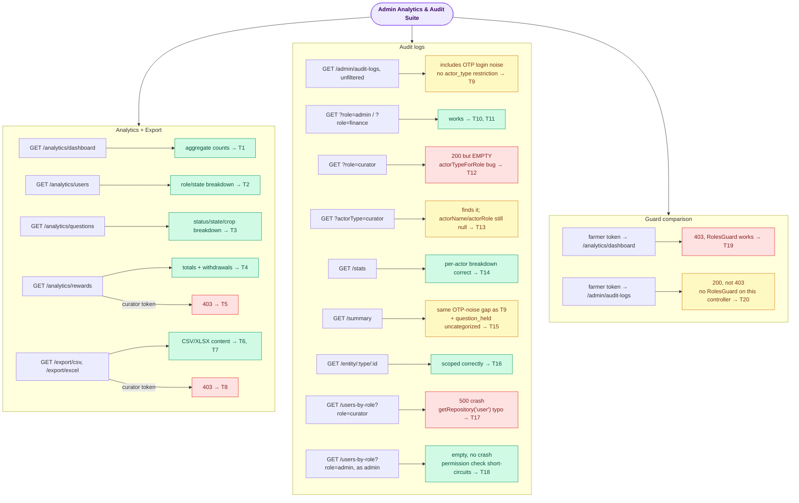

# Admin Analytics & Audit E2E Suite

## What this suite covers

End-to-end coverage of the two admin controllers no other suite touches:

- `AnalyticsController` / `ExportController` (`/analytics/*`, `/export/*`) — dashboard
  aggregation, per-domain analytics (users/questions/rewards), CSV/XLSX export, and role
  restrictions (rewards + export are admin/super\_admin only; dashboard/users/questions also
  allow curator/finance)
- `AuditController` (`/admin/audit-logs/*`) — paginated log query, per-actor stats, a
  time-bucketed summary, single-entity history, and the role→user-list lookup used by the audit
  filter dropdown

**This suite surfaced four real, previously-undetected bugs in `audit.service.ts` while being
built** (Layer 10 was "planned, not yet built" until now — this is the first time these code
paths have run under any test). Per team decision (2026-07-17): document and test the *actual*
current behavior, do not fix the source. All four are called out below and in `test_plan.md`.

## Real bugs found (documented, not fixed — team decision)

1. **`GET /admin/audit-logs/users-by-role` crashes with 500** whenever the caller's role passes
   the permission check (T17). `getUsersByRole()` calls
   `this.dataSource.getRepository('user')` — a lowercase string that doesn't match the
   registered entity name (`User`) — so TypeORM throws `EntityMetadataNotFoundError` before any
   query runs. The same `getRepository('user')` typo also exists in `queryAuditLogs()`'s
   `actorId`-filter branch, though this suite doesn't exercise that specific path.
2. **`actorTypeForRole()` only special-cases `'finance'`; every other role (including
   `'curator'`) falls through to `'admin'`.** This silently breaks `role=curator` filtering in
   `queryAuditLogs`, `getActorStats`, and `getSummary` — `GET /admin/audit-logs?role=curator`
   returns an empty result (T12) instead of the curator's actual entries, even though those
   entries exist and are found instantly via the `actorType=curator` param instead (T13).
   `role=admin` and `role=finance` happen to still work (T10, T11) — `admin` by coincidence of
   the fallback default, `finance` because it's the one explicit branch.
3. **`actorName`/`actorRole` are always `null`** in every `GET /admin/audit-logs` response item
   (T13). `queryAuditLogs()` does `.leftJoin('users', 'u', ...)` (not `leftJoinAndSelect` /
   `leftJoinAndMapOne`) then manually appends `'u.name'`/`'u.role'` to `.select([...])`. Since
   `u` isn't a declared relation on the `AuditLog` entity, `getManyAndCount()`'s entity hydration
   silently drops those extra joined columns rather than attaching them as `item.u` — so the
   mapping code's `(item as unknown as { u?: {...} }).u?.role` always reads `undefined`. The
   actor's own `actorId`/`actorType` are real `AuditLog` columns and are unaffected; only the
   joined display fields are silently blank for every row, for every caller.
4. **Unfiltered queries include audit-noise from every other user's login**, not just admin
   activity (T9, T15). `buildRoleFilters`/`buildStatsRoleFilters` only restrict anything when
   `authRole === SUPER_ADMIN` and a `role` param is given; with neither, `actorTypes` comes back
   `null`. `queryAuditLogs` and `getSummary` then apply **no** actor-type restriction at all,
   so a super\_admin's unfiltered list/summary includes every plain user's `otp_requested`/
   `otp_verified` rows too. (This one is arguably intentional — a super\_admin plausibly *should*
   see everything — but is easy to be surprised by, hence documented here. Contrast with
   `getActorStats`, T14, which defaults to `['admin','curator','finance']` when unrestricted, so
   it does *not* pick up this noise — the three methods are inconsistent with each other.)

## Not a bug, but a related access-control gap worth flagging separately

`AuditController` has **no `RolesGuard`/`@Roles()` at all** — only `@UseGuards(JwtAuthGuard)`.
Contrast with the sibling `AnalyticsController`, which correctly 403s a plain farmer token
(T19). A plain `user`-role caller hitting `/admin/audit-logs` gets **200**, not 403 (T20) — and,
combined with bug #2 above, actually only sees the `finance`-authored entry (the curator one is
filtered out by the same `actorTypeForRole` collapse). This is a genuine access-control gap
(any authenticated user can read finance-tier audit history), separate from the four
service-logic bugs above. Flagged here for the same "document only, revisit separately" handling
as the Razorpay webhook-signature finding from Layer 9.

## Endpoints exercised

| Method | Path | Tests |
|---|---|---|
| GET | `/analytics/dashboard` | T1, T19 |
| GET | `/analytics/users` | T2 |
| GET | `/analytics/questions` | T3 |
| GET | `/analytics/rewards` | T4, T5 |
| GET | `/export/csv` | T6, T8 |
| GET | `/export/excel` | T7 |
| GET | `/admin/audit-logs` | T9, T10, T11, T12, T13, T20 |
| GET | `/admin/audit-logs/stats` | T14 |
| GET | `/admin/audit-logs/summary` | T15 |
| GET | `/admin/audit-logs/entity/:entityType/:entityId` | T16 |
| GET | `/admin/audit-logs/users-by-role` | T17, T18 |

## Actors

| Mobile | Role | Used in |
|---|---|---|
| 9000000001 | user (farmer) | T19, T20 (unauthorized-access checks) |
| 9000000002 | user (student) | Question seed data only (human\_review question) |
| 9000000003 | curator | T5, T8 (role-restriction checks), audit-log actor |
| 9000000004 | finance | Audit-log actor only |
| 9000000005 | admin | T1–T4, T6–T7, T17–T18, audit-log actor |
| 9000000006 | super\_admin | T9–T16 |

## Seeded data (beforeAll)

| Item | How seeded | Purpose |
|---|---|---|
| 6 test users + wallets + admin config | `seedTestUsers()` | Base users |
| Tokens for all 6 users | `getAuthToken()` | Access tokens; incidentally creates 12 `otp_requested`/`otp_verified` audit rows used by bugs #3/#4's tests |
| 2 approved + 1 rejected question (farmer, Maharashtra) | Direct repo insert | Question/state/crop analytics breakdowns |
| 1 human\_review question (student, Karnataka) | Direct repo insert | Global "pending" count in question analytics |
| 2 reward transactions (₹2, ₹3) on farmer's wallet | Direct repo insert | Reward analytics totals |
| 1 pending withdrawal request (farmer, ₹10) | Direct repo insert | Withdrawal analytics sub-object |
| 4 audit\_log rows (2 admin `question_approved`, 1 curator `question_held`, 1 finance `admin_config_updated`) | Direct repo insert | Audit-log query/stats/summary/entity/role tests |

No AI/payment mocks needed — neither controller calls an external service.

## Business logic exercised

- **`getQuestionAnalytics`'s "pending" count is date-unfiltered** (T3) — unlike `total`/
  `approved`/`rejected`, which all apply the `submittedAt` date-range `baseWhere`, the pending
  count queries `status IN (pending, ai_review, human_review)` with no date filter at all.
- **Reward analytics' `withdrawals` sub-object counts by status** (T4) — `totalWithdrawn` sums
  `amount` regardless of status; `pending`/`completed`/`failed` are separate `CASE WHEN` counts.
- **Analytics role tiers differ per endpoint** — dashboard/users/questions allow
  admin/super\_admin/curator/finance; `rewards` (T5) and both export routes (T8) are
  admin/super\_admin only.
- **CSV export column order is fixed and asserted verbatim** (T6) — a byte-for-byte header
  check, since `toCSV()` builds the header directly from the `columns` array passed in.
- See the "Real bugs found" section above for the audit-log-specific logic this suite
  uncovered — that's the bulk of what's non-obvious here.

## Flow diagram

> To preview locally: install "Markdown Preview Mermaid Support" in VS Code, then press Ctrl+Shift+V.

## Last run

| Date | Pass | Fail | Notes |
|---|---|---|---|
| 2026-07-17 | 20 | 0 | All green, both standalone and as part of the full `vitest run` (123-test) suite. The same 3 pre-existing, unrelated failures (`WalletReward.e2e.test.ts` T8/T18, `AIPipeline.e2e.test.ts` "Admin config…") reproduce identically with this file included — confirmed not caused by this suite. |
