# AdminOps E2E Suite

## What this suite covers

End-to-end coverage of the `AdminController` surface (`/admin/*`):

- Question review queue: list, filter, approve / reject / hold actions
- Audit log verification (approve and config-change events)
- User management: list, detail, suspend, unsuspend
- Admin config: list and update (including the daily-limit enforcement integration)
- Platform stats (`/admin/stats`)
- Fraud monitoring (`/admin/fraud`)
- Wallet admin view (`/admin/wallets`)
- Withdrawal admin view and processing (`/admin/withdrawals`, `POST /admin/withdrawals/:id/process`)
- Manual wallet adjustment (`/admin/wallets/adjust`) — KNOWN BUG (always 403)
- User creation (`POST /admin/users`) — role guard and happy path

## Intentionally out of scope

- Analytics export (`/admin/export`) — CSV streaming not suitable for this framework
- Reward logs (`/admin/analytics/reward-logs`) — covered by WalletReward suite indirectly
- Financial summary (`/admin/analytics/financial-summary`) — read-only aggregation, no critical wiring
- Retry / fail / retry-refund withdrawal paths — too many external Razorpay failure scenarios; covered by unit tests

## Endpoints exercised

| Method | Path | Tests |
|---|---|---|
| GET | `/admin/questions/queue` | T1, T2 |
| POST | `/admin/questions/:id/review` | T3 (approve), T4 (reject), T5 (hold) |
| GET | `/admin/users` | T7 |
| GET | `/admin/users/:id` | T8 |
| POST | `/admin/users/:id/suspend` | T9 |
| POST | `/admin/users/:id/unsuspend` | T10 |
| GET | `/admin/config` | T11 |
| PATCH | `/admin/config` | T12, T13 |
| GET | `/admin/stats` | T14 |
| GET | `/admin/fraud` | T15 |
| GET | `/admin/wallets` | T16 |
| GET | `/admin/withdrawals` | T17 |
| POST | `/admin/withdrawals/:id/process` | T18 |
| POST | `/admin/wallets/adjust` | T19 |
| POST | `/admin/users` | T20, T21 |

## Actors

| Mobile | Role | Token variable |
|---|---|---|
| 9000000001 | user (farmer) | `farmerToken` |
| 9000000003 | curator | `curatorToken` |
| 9000000005 | admin | `adminToken` |
| 9000000006 | super_admin | `superAdminToken` |

## Seeded data (beforeAll)

| Item | How seeded | Purpose |
|---|---|---|
| 6 test users + wallets + admin config | `seedTestUsers()` | Base for all tests |
| 3 HUMAN_REVIEW questions | direct TypeORM insert | Review action tests (T3-T6) |
| 1 REJECTED question with duplicateFlag=true | direct TypeORM insert | Fraud stats (T15) |
| `UserPaymentDetail` (status=verified, UPI) | direct TypeORM insert | processWithdrawal (T18) |
| `WithdrawalRequest` (status=PENDING, ₹100) | direct TypeORM insert | Withdrawal list (T17) + process (T18) |

## External services mocked

| Service | Methods mocked | Default return |
|---|---|---|
| `RazorpayPayoutService` | `createFundAccount`, `initiatePayout` | `fa_test_default / po_test_default`, `status: 'processing'` |
| `GemmaService` | `inferCropAndDomains` | `{ crop: 'soybean', domains: [...], confidence: 0.95 }` |
| `GdbService` | `checkDuplicate` | `{ isDuplicate: false }` |
| `EmbedService` | `embed` | `[0.1, 0.2, 0.3]` |
| `SarvamService` | `transcribeBuffer`, `translateText` | mock transcription |

Per-test overrides in T18 use `vi.mocked(...).mockResolvedValueOnce(...)`.

## Known bugs documented in tests

### T19 — `POST /admin/wallets/adjust` always 403

`AdminService.adjustWalletBalance` (line 3026) has an unconditional `throw new ForbiddenException(...)` after a commented-out `isSuperAdmin` guard:

```ts
const isSuperAdmin = await this.isSuperAdmin(adminId);
// if (!isSuperAdmin)
throw new ForbiddenException('Only super admins can manually adjust wallet balances');
```

**Expected:** 200 when called by `super_admin`
**Actual:** 403 for all callers
**Test pinned to actual (403).** Fix: reinstate the `if (!isSuperAdmin)` guard condition.

## Business logic exercised

- **Role guards:** controller-level `@Roles()` decorator blocks `user` from queue (T2) and `curator` from `createUser` (T21)
- **Service-level super_admin check:** `suspendOrBanUser` / `unsuspendOrUnbanUser` check DB role, not just JWT role. Only super_admin can suspend (T9) or unsuspend (T10).
- **Question status lifecycle:** HUMAN_REVIEW → APPROVED (T3) / REJECTED (T4) / HELD (T5). Double-review blocked (terminal statuses).
- **Wallet reward credit on approve:** `reviewQuestion` approve path calls `walletsService.creditReward`; response includes `rewardCredited` (T3).
- **Audit log writes:** QUESTION_APPROVED (T6) and ADMIN_CONFIG_UPDATED (T13) verified in DB.
- **Config cache invalidation:** PATCH config deletes key from in-memory cache; next question submission reads new value from DB (T12).
- **Razorpay payout flow:** `processWithdrawal` (approve) → `createFundAccount` (no cached fund account) → `initiatePayout` → PROCESSING status (T18).

## Flow diagram

> To preview locally: install "Markdown Preview Mermaid Support" in VS Code, then press Ctrl+Shift+V.

```mermaid
flowchart TD
  classDef entry  fill:#ede9fe,stroke:#7c3aed,color:#3b0764,font-weight:bold
  classDef ok     fill:#d1fae5,stroke:#059669,color:#064e3b
  classDef warn   fill:#fef9c3,stroke:#d97706,color:#78350f
  classDef err    fill:#fee2e2,stroke:#dc2626,color:#7f1d1d
  classDef decide fill:#faf5ff,stroke:#7c3aed,color:#3b0764

  SUITE([AdminOps Suite]):::entry

  subgraph Review["Question Review"]
    Q1[GET /admin/questions/queue]
    Q1 -->|admin → 200, items≥3| Q1OK[Queue visible → T1]:::ok
    Q1 -->|farmer user → 403| Q1ERR[Role guard → T2]:::err
    Q2[POST /admin/questions/:id/review]
    Q2 -->|approve → 200, rewardCredited| Q2A[APPROVED + wallet + audit → T3, T6]:::ok
    Q2 -->|reject + reason → 200| Q2R[REJECTED, reason stored → T4]:::ok
    Q2 -->|hold + heldReason → 200| Q2H[HELD → T5]:::warn
  end

  subgraph Users["User Management"]
    U1[GET /admin/users] --> U1OK[Paginated list → T7]:::ok
    U2[GET /admin/users/:id] --> U2OK[Full record + questions + paymentDetails → T8]:::ok
    U3[POST /admin/users/:id/suspend]
    U3 -->|super_admin → 200| U3OK[SUSPENDED + audit → T9]:::warn
    U4[POST /admin/users/:id/unsuspend]
    U4 -->|super_admin → 200| U4OK[VERIFIED + audit → T10]:::ok
    U5[POST /admin/users] -->|super_admin, role=admin → 201| U5OK[User created → T20]:::ok
    U5 -->|curator → 403| U5ERR[Role guard → T21]:::err
  end

  subgraph Config["Configuration"]
    C1[GET /admin/config] --> C1OK[All keys listed → T11]:::ok
    C2[PATCH /admin/config] -->|daily_limit=1 → 200| C2OK[Config updated → T12]:::ok
    C2 --> C2AUDIT[audit_log: ADMIN_CONFIG_UPDATED → T13]:::ok
    C2OK -->|1st submit → 201| SUBQ1[Submit succeeds]:::ok
    C2OK -->|2nd submit → 400| SUBQ2[Daily limit enforced → T12]:::err
  end

  subgraph Analytics["Stats / Fraud"]
    S1[GET /admin/stats] --> S1OK[Dashboard counts → T14]:::ok
    S2[GET /admin/fraud] --> S2OK[duplicateSubmissions ≥ 1 → T15]:::ok
  end

  subgraph Finance["Wallets / Withdrawals"]
    W1[GET /admin/wallets] --> W1OK[All wallets visible → T16]:::ok
    W2[GET /admin/withdrawals] --> W2OK[Pending withdrawal in list → T17]:::ok
    W3[POST /admin/withdrawals/:id/process]
    W3 -->|approve, Razorpay mock status=processing| W3OK[PROCESSING, payoutId set → T18]:::ok
    W4[POST /admin/wallets/adjust] -->|super_admin → 403 KNOWN BUG| W4BUG[Unconditional throw → T19]:::err
  end

  SUITE --> Review
  SUITE --> Users
  SUITE --> Config
  SUITE --> Analytics
  SUITE --> Finance
```



## Last run

| Date | Pass | Fail | Notes |
|---|---|---|---|
| 2026-08-12 | 15 | 6 | First real run. `develop` had migrated the backend from PostgreSQL/TypeORM to MongoDB/Mongoose before this suite was ever exercised (see `test_plan.md`'s 2026-08-12 section). Rewrote `DataSource` usage onto the repository abstraction; replaced the removed `QuestionStatus.HUMAN_REVIEW` with `PENDING` (all new submissions now go straight to PENDING — see AIPipeline/QuestionSubmit for the same change). All 6 failures map to root causes already established in other suites this session, not new categories — see below. |

**6 real bugs, not fixed, all matching already-established root causes:**

- **T3 (approve → 500), T6 (cascades from T3):** `WalletsService.creditReward()` (`wallets.service.ts:102`, via `AdminService.reviewQuestion()` at `admin.service.ts:769`) throws `DataSource is not available when DB=mongo` — same root cause documented in `WalletReward.e2e.md` (`this.ds` is an `@Optional()` TypeORM `DataSource` `AppModule` never provides). Approving a question can never credit the farmer's reward right now.
- **T11 (config items always `[]`):** `AdminService.listConfig()` calls `this.configRepo.find({ order: { key: 'ASC' } })` — same root cause documented in `AIPipeline.e2e.md` (a TypeORM-style options object with no `where` wrapper is treated as a literal Mongo filter).
- **T15 (fraud list empty), T16 (`wallet.user` undefined), T18 (`processWithdrawal` crashes reading `withdrawal.user.mobileNumber`):** `AdminService.getFraudStats()`/`.listAllWallets()`/`.processWithdrawal()` all use TypeORM relation-based joins (`innerJoin('q.user', 'u')`, `innerJoinAndSelect('w.user', 'u')`) — same root cause documented in `UserProfile.e2e.md`'s leaderboard finding and `AdminAnalyticsAudit.e2e.md`'s audit-log join finding: `MongoQueryBuilder` has no real relation-join support, so joined fields never hydrate.
