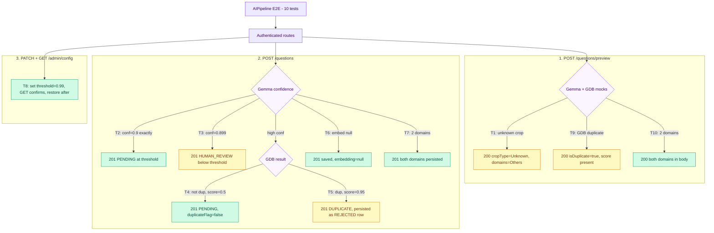

# AI Pipeline — E2E Test Documentation

**File:** `test/e2e/ai-pipeline/AIPipeline.e2e.test.ts`

---

## What this covers

The server-side AI pipeline exercised end-to-end: Gemma crop/domain inference, GDB semantic
duplicate detection, and the embedding service — verified through the **real HTTP layer**
against the live PostgreSQL DB. Tests confirm confidence thresholds, duplicate routing,
embedding failure tolerance, and admin config propagation.

| Method  | Endpoint                  | Purpose                                      |
|---------|---------------------------|----------------------------------------------|
| `POST`  | `/questions/preview`      | Preview enrichment via Gemma + GDB           |
| `POST`  | `/questions`              | Submit; triggers full AI pipeline            |
| `PATCH` | `/admin/config`           | Update duplicate similarity threshold        |
| `GET`   | `/admin/config`           | Read back updated config value               |

---

## Strategy

Same in-process NestJS harness as `QuestionSubmit`. Three AI service doubles are registered
in `createTestApp()` and returned for per-test override:

| Double          | Default stub                                              |
|-----------------|-----------------------------------------------------------|
| `GemmaService`  | `{ crop: 'soybean', domains: ['Insect - Pest Management'], confidence: 0.95 }` |
| `GdbService`    | `{ isDuplicate: false, … }`                               |
| `EmbedService`  | `[0.1, 0.2, 0.3]`                                         |

`beforeEach` resets all mocks and restores these defaults so every test starts clean.
Per-test overrides use `mockResolvedValueOnce`.

| Token         | Mobile       | Role    | Purpose                          |
|---------------|--------------|---------|----------------------------------|
| `farmerToken` | `9000000001` | USER    | primary submitter                |
| `adminToken`  | `9000000005` | ADMIN   | update config, access admin APIs |

---

## Flow diagram

> **To preview locally:** install the VS Code extension
> **"Markdown Preview Mermaid Support"** then press `Ctrl+Shift+V`.
> Diagrams also render natively on GitHub.

---

## Test cases (10 total)

### Preview (3 tests)

| #   | Test | Mock | Expected |
|-----|------|------|----------|
| T1  | Gemma "Unknown" crop reflected in preview | Gemma `crop='Unknown'`, `confidence=0.4` | 200; `cropType='Unknown'`, `domains=['Others']` |
| T9  | GDB duplicate result surfaced in preview | GDB `isDuplicate=true`, score=0.97 | 200; `duplicate.isDuplicate=true`, `matchedQuestion` set |
| T10 | Multiple Gemma domains in preview | Gemma `domains=['Insect…','Disease…']` | 200; both domains present in response |

### Submit — confidence threshold (2 tests)

| #  | Test | Mock | Expected |
|----|------|------|----------|
| T2 | Confidence exactly 0.9 → PENDING | Gemma `confidence=0.9` | 201 · `PENDING` |
| T3 | Confidence 0.899 → HUMAN_REVIEW | Gemma `confidence=0.899` | 201 · `HUMAN_REVIEW` |

### Submit — GDB routing (2 tests)

| #  | Test | Mock | Expected |
|----|------|------|----------|
| T4 | GDB similarity below threshold → PENDING | GDB `isDuplicate=false`, score=0.5 | 201 · `PENDING`; `duplicateFlag=false` in DB |
| T5 | GDB detects duplicate → DUPLICATE | GDB `isDuplicate=true`, score=0.95 | 201 · `DUPLICATE`; `id` is a real persisted (REJECTED) question row; `matchedQuestion` + `matchedAnswer` present |

### Submit — embedding tolerance (1 test)

| #  | Test | Mock | Expected |
|----|------|------|----------|
| T6 | Embedding returns null → question saves | `embed` mock returns `null` | 201; question row saved with `embedding=null` |

### Submit — domain storage (1 test)

| #  | Test | Expected |
|----|------|----------|
| T7 | Two domains in payload → both stored | `domains=['Insect - Pest Management','Disease Management']` in payload → both present on saved DB row |

### Admin config (1 test)

| #  | Test | Expected |
|----|------|----------|
| T8 | Threshold update persists | `PATCH duplicate_similarity_threshold=0.99` → `GET /admin/config` confirms value=0.99; restored to 0.9 after |

---

## Notable implementation details

- **Confidence boundary:** the service uses `confidence < 0.9` to route to `HUMAN_REVIEW`,
  so exactly `0.9` goes to `PENDING`. T2 and T3 pin both sides of that boundary.
- **DUPLICATE response shape:** when GDB flags a duplicate, the submit endpoint returns
  `{ id, status: 'DUPLICATE', duplicate: { isDuplicate, matchedQuestion, matchedAnswer, similarityScore } }`.
  Corrected 2026-07-24 — a real question row **is** written (status `REJECTED`), same design as
  the exact-DB-duplicate path in `preview()`; it counts against the daily limit. T5 was
  previously asserting `id: ''` (no row persisted at all), which was stale — this was never
  actually exercised end-to-end until now, since the test environment's Redis-dependent
  duplicate gate ahead of this code path always 500'd before `docker-compose.test.yml` had a
  real Redis service.
- **Embedding null tolerance:** `EmbedService.embed()` already returns `null` on any network
  failure. T6 forces this path explicitly; the question saves with `embedding: null`.
- **Config cache:** `AdminService` caches config for 30 s. T8 relies on the cache being
  invalidated immediately after `PATCH` (the service calls `configCache.delete(key)` after
  every update).
- **`beforeEach` mock reset:** `vi.clearAllMocks()` wipes call counts; default
  implementations are restored manually so they do not bleed between tests.

---

## Cleanup

`afterAll` calls `cleanTestData(dataSource)` (full `TRUNCATE … CASCADE`) then closes the app.

---

## Last run

**Date:** 2026-07-24 | **Result:** 10/10 passing.

Previously 2 failures, both now fixed as stale test expectations (not product bugs):

- **`Admin config - duplicate_similarity_threshold update persists`** was reading
  `configResponse.body.config`, but `AdminService.listConfig()` returns `{ items: [...] }` (and
  always has — confirmed via git history, this was never `{ config: [...] }` at any point).
  `configResponse.body.config` was `undefined`, so `.find?.()` silently no-opped via optional
  chaining instead of throwing. Fixed by reading `.items` directly.
- **`Submit - GDB detects duplicate...`** asserted `response.body.id` toBe `''`, assuming
  DUPLICATE responses persist no row. Corrected: GDB-detected duplicates ARE persisted as a
  real `REJECTED` question row (see "Notable implementation details" above) — fixed to assert
  a real id and confirm the row via a direct DB read.

Both were latent — this suite had never actually run end-to-end before 2026-07-16/17 (its own
doc said "pending first run" until then), so neither had ever been checked against the real,
current behavior until this pass.

**Date:** 2026-08-12 | **Result:** 10/10 passing.

`develop` migrated the backend from PostgreSQL/TypeORM to MongoDB/Mongoose (see `test_plan.md`'s
2026-08-12 section). Two updates were needed, both behavioral (not bugs):

- Rewrote `DataSource`/`getRepository()` usage onto the new repository abstraction.
- The AI_REVIEW/HUMAN_REVIEW confidence-branching logic was removed entirely on `develop`
  ("streamline question review process by removing AI and human review statuses") —
  `QuestionStatus` no longer has those members at all. Test 3 ("confidence 0.899 →
  HUMAN_REVIEW") now asserts the new real behavior: every submission goes to `PENDING`
  regardless of Gemma confidence (`question.service.ts:311-312`).

Also found (not fixed) a real bug in Test 8: `AdminService.listConfig()` calls
`this.configRepo.find({ order: { key: 'ASC' } })` — a TypeORM-style call with no `where`
wrapper. The Mongo repository's `find(filter)` treats its whole argument as a literal filter
(no `order`/`take`/`select` support), so it searches for a field literally named `order`, which
no document has — `GET /admin/config` unconditionally returns `{ items: [] }` in Mongo mode.
`PATCH /admin/config` itself persists correctly (confirmed — only the list-back path is
broken), so Test 8 now verifies persistence directly via the config repository instead of
round-tripping through the broken `GET` endpoint. See `AdminAnalyticsAudit.e2e.md` /
`AdminOps.e2e.md` for the wider pattern this bug belongs to (5 call sites in
`admin.service.ts` all pass TypeORM-style options objects to the Mongo `find()`).
