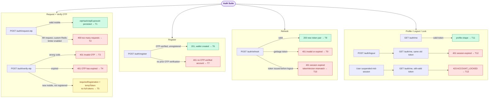

# Auth E2E Suite

## What this suite covers

End-to-end coverage of the module every other suite depends on but which had no dedicated
coverage of its own:

- OTP request → DB persistence (`otpHash`, `otpExpiresAt`)
- OTP rate limiting (3 requests / 15 min, Redis-backed counter)
- OTP verification: wrong code, expired code, brand-new mobile number (registration branch)
- Registration completing an OTP-verified-but-unregistered user
- Refresh token exchange, invalid token rejection, and `tokenVersion` invalidation applied to
  refresh tokens (not just access tokens)
- `GET /auth/me` profile shape
- Logout invalidating the previously issued access token
- A suspended user's still-valid access token being rejected with 423 on the next request

## Intentionally out of scope

- Real SMS delivery — `.env.test` sets `SMS_PROVIDER=mock`, so `SmsService` only logs the OTP.
  No provider mock override needed.
- The web-client-only restriction branch in `requestOtp` (`dto.client === 'web'` → only
  admin/curator/finance accounts allowed) — pure role-branching logic with no other moving
  parts; better suited to `auth.service.spec.ts`.
- NestJS's global `@Throttle` decorator on `POST /auth/request-otp` — `THROTTLE_ENABLED=false`
  in `.env.test` disables the global `ThrottlerGuard` entirely (needed so other suites' rapid
  sequential requests don't trip it), so the decorator has no effect in this environment. T2
  instead exercises the separate, custom Redis-backed rate limit inside `AuthService` itself.

## Endpoints exercised

| Method | Path | Tests |
|---|---|---|
| POST | `/auth/request-otp` | T1, T2, T3 (setup), T4 (setup), T5 (setup), T6 (setup), T8 (setup), T10 (setup) |
| POST | `/auth/verify-otp` | T3, T4, T5, T6 (setup), T8, T10 (setup) |
| POST | `/auth/register` | T6, T7 |
| POST | `/auth/refresh` | T8, T9, T10 |
| GET | `/auth/me` | T11, T12, T13 |
| POST | `/auth/logout` | T10 (setup), T12, T13 (setup) |

## Actors

Uses seeded users directly by mobile number (no shared token variable — each test gets its own
token so `tokenVersion`/OTP mutations in one test can't bleed into another):

| Mobile | Role | Used in |
|---|---|---|
| 9000000001 | user (farmer) | T3, T4 |
| 9000000002 | user (student) | T8 |
| 9000000003 | curator | T10 |
| 9000000004 | finance | T11 |
| 9000000005 | admin | T12 |
| 9000000006 | super_admin | T13 (suspended, then restored at the end of the test) |
| 9111111101, …02, …05, …06, …07 | none (fresh numbers, never seeded) | T1, T2, T5, T6, T7 — new-user/registration flows need a mobile with no prior user record |

## Seeded data (beforeAll)

| Item | How seeded | Purpose |
|---|---|---|
| 6 test users + wallets + admin config | `seedTestUsers()` | Base users for the existing-user flows above |

No additional per-test seeding beyond direct `otpHash`/`otpExpiresAt` writes (see below).

## External services mocked

None needed. `SMS_PROVIDER=mock` in `.env.test` already short-circuits `SmsService.sendOtp` to
a console log — no gateway call happens. Redis (`REDIS_HOST=localhost:6380`) has nothing
listening in the test environment, so `RedisService` fails over to its in-memory store on the
first connection error, which is enough for the rate-limit counter in T2.

## Business logic exercised

- **OTP retrieval trick:** the OTP is bcrypt-hashed one-way in the DB, so it can't be read back
  through the API. Every test that needs a known OTP calls `request-otp` for real (to exercise
  that code path), then overwrites `user.otpHash` directly via TypeORM with
  `bcrypt.hash('123456', 12)` — the same trick `auth.helper.ts` already uses for every other
  suite's token minting.
- **Rate limit (T2):** `.env.test` sets `OTP_RATE_LIMIT=false` globally. T2 spies on
  `ConfigService.get` (scoped to just the `'app.otpRateLimit'` key, restored via
  `spy.mockRestore()` in a `finally` block) so only this one test enables the check, without
  depending on process-level env var isolation between vitest's forked test files.
- **Expiry check happens before the OTP comparison** (T4) — `auth.service.ts` checks
  `otpExpiresAt` before `bcrypt.compare`, so an expired-but-correct code still 401s.
- **Registration branch vs. returning-user branch (T5):** `verifyOtp` checks
  `user.name?.trim().length > 0` to decide between issuing a `tempToken` (registration required)
  or full auth tokens.
- **`/auth/register` does not verify the `tempToken` at all** (T6, T7) — it looks the user up
  fresh by `mobileNumber` from the request body and checks the user exists (i.e., was
  OTP-verified). Confirmed by reading `auth.controller.ts`; noted here since the `tempToken`
  returned by `verify-otp` looks load-bearing but currently isn't consumed anywhere in this path.
- **`tokenVersion` invalidation applies to refresh tokens, not just access tokens** (T10) —
  `refreshTokens()` checks `user.tokenVersion !== payload.tokenVersion` the same way
  `JwtStrategy.validate()` does for access tokens. Refresh tokens are *not* rotated on use
  (`issueTokens()` explicitly does not bump `tokenVersion`) — they only become invalid once
  logout increments it.
- **423 (Locked), not 401, for suspended/banned users** (T13) — enforced in
  `JwtAuthGuard.handleRequest`, not in `JwtStrategy.validate()` (a deliberate split so Passport
  doesn't collapse it into a generic 401); response body carries `error: 'ACCOUNT_LOCKED'` and
  `status`, matching the contract mobile's `AccountLockedContext` expects.

## Flow diagram

> To preview locally: install "Markdown Preview Mermaid Support" in VS Code, then press Ctrl+Shift+V.

## Last run

| Date | Pass | Fail | Notes |
|---|---|---|---|
| 2026-07-16 | 13 | 0 | All green, both standalone and as part of the full `vitest run` (94-test) suite. Confirmed pre-existing, unrelated failures in `WalletReward.e2e.test.ts` (T8, T18) and `AIPipeline.e2e.test.ts` ("Admin config…") reproduce identically with this file excluded from the run — not caused by this suite. |
| 2026-07-24 | 13 | 0 | After a `develop` merge, `RegisterDto` gained a required `username` field. T6/T7's register payloads predated that field and started failing 400 instead of 201/401. Fixed by adding `username: 'new_farmer_106'` / `'ghost_user_107'` to the two payloads — no source change, test fixtures were just stale. |
| 2026-08-12 | 13 | 0 | Second `develop` merge migrated the backend from PostgreSQL/TypeORM to MongoDB/Mongoose (see `test_plan.md`'s 2026-08-12 section for the full investigation). Rewrote this suite's `DataSource`/`getRepository()` usage onto the new repository abstraction (`app.get(REPOSITORY_TOKENS.User)`, all CRUD methods return plain objects with `id: string`). Otp rate limit raised from 3→10/15min on `develop` ("increase OTP request limit to 10 per 15 minutes") — T2 updated to loop 10 times instead of 3, not a bug. Also found and fixed a **new** real bug during this pass: `AuthService.requestOtp()` creates a stub `User` (no `username`) for any never-before-seen mobile number; the Mongoose schema has `username` as `unique: true, sparse: true, default: null`, but `default: null` writes an *explicit* null, and sparse indexes only skip *absent* fields — so the second-ever pre-registration OTP request in a fresh DB always 500s on a duplicate-key collision. This is a real, production-affecting bug (any two people signing up back-to-back would hit it), not fixed here — worked around in T1/T2/T5 by immediately clearing the null to a unique placeholder after each fresh stub is created, so the rest of the suite still exercises real request-otp/verify-otp/register behavior. |
