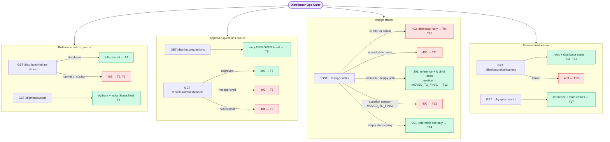

# Distributor Ops E2E Suite

## What this suite covers

End-to-end coverage of `DistributorController` (`/distributor/*`) — a new module added in the
same `develop` merge that migrated the backend from PostgreSQL/TypeORM to MongoDB/Mongoose (see
`test_plan.md`'s 2026-08-12 section), with zero prior test coverage:

- `GET /distributor/indian-states` — reference data + role guard
- `GET /distributor/stats` — per-state distribution counts
- `GET /distributor/questions` / `GET /distributor/questions/:id` — the approved-questions queue
- `POST /distributor/questions/:id/assign-states` — the core workflow: distributing an approved
  question to one or more Indian states, which snapshots the question into `final_questions`
  and flips its status to `MOVED_TO_FINAL`
- `GET /distributor/distributions` / `GET /distributor/distributions/by-question/:questionId` —
  browsing the distributed copies, with distributor-name enrichment
- Role guarding: class-level `@Roles(DISTRIBUTOR, ADMIN, SUPER_ADMIN)` vs. the method-level
  `@Roles(DISTRIBUTOR)` override on `assign-states` (admin/super_admin can browse but not act)

## Intentionally out of scope

- FAQ/report/notification side effects of distribution, if any — not present in
  `DistributorService` as of this merge.
- Concurrent-race handling on the reference-doc creation (`E11000` recovery path in
  `assignStates()`) — the code has an explicit comment describing the race-recovery logic, but
  reproducing a genuine concurrent double-write deterministically in an e2e test isn't practical;
  covered by the code's own design rather than a test here.

## Endpoints exercised

| Method | Path | Tests |
|---|---|---|
| GET | `/distributor/indian-states` | T1, T2, T3 |
| GET | `/distributor/stats` | T4 |
| GET | `/distributor/questions` | T5 |
| GET | `/distributor/questions/:id` | T6, T7, T8 |
| POST | `/distributor/questions/:id/assign-states` | T9, T10, T11, T12, T13, T14 |
| GET | `/distributor/distributions` | T15, T16, T18 |
| GET | `/distributor/distributions/by-question/:questionId` | T17 |

## Actors

| Mobile | Role | Used in |
|---|---|---|
| 9000000009 | distributor | Seeded locally in this suite's `beforeAll` — `seedTestUsers()`'s base 6 users don't include a distributor. Primary actor for all read + the assign-states write. |
| 9000000005 | admin | T4, T10 (browse-but-not-act) |
| 9000000003 | curator | T3, T9 (class guard excludes curator entirely) |
| 9000000001 | user (farmer) | T2, T18 (role-guard negative cases) |

## Seeded data

| Item | How seeded | Purpose |
|---|---|---|
| 6 base test users + wallets + admin config | `seedTestUsers()` (beforeAll) | Base users |
| 1 distributor user (mobile `9000000009`) | Direct repo insert in beforeAll | `seedTestUsers()` has no distributor role; given a unique `username` to avoid the sparse-unique-null collision documented in `Auth.e2e.md` |
| 2 `APPROVED` questions + 1 `REJECTED` question | Direct repo inserts in beforeAll | Queue listing (T5), detail read (T6/T7), assign-states targets (T9-T14) |

No AI/payment mocks needed — this controller never calls an external service.

## Business logic exercised

- **One reference doc + N state-specific child docs per distribution.** The first
  `assign-states` call for a question creates a canonical reference doc
  (`isReference: true, distributionState: null, parentReferenceId: null`) plus one child row per
  requested state (`parentReferenceId` pointing at the reference doc). T12 seeds 2 states and
  asserts exactly 3 `final_questions` rows exist afterward (1 + 2).
- **Empty `states: []` is valid** — it creates only the reference doc, used for questions that
  aren't state-specific (T14).
- **The parent question can only be distributed once.** `assignStates()` requires
  `status === APPROVED`; once flipped to `MOVED_TO_FINAL` (T12), a second call on the same
  question is rejected outright with 400 (T13) — it never reaches the per-state "already
  assigned, skip" logic that exists in the code for a still-APPROVED question with an overlapping
  state list.
- **Role guard is two-tiered.** The controller class carries
  `@Roles(DISTRIBUTOR, ADMIN, SUPER_ADMIN)` (T2/T3/T18 confirm farmer and curator both get 403 on
  everything), but `assign-states` itself is additionally decorated with the narrower
  `@Roles(DISTRIBUTOR)`, which `RolesGuard`'s `getAllAndOverride` resolves in favor of the
  method-level decorator — so admin/super_admin can browse the queue and distributions but
  cannot perform the distribute action themselves (T10).
- **Distributions list enriches `distributorId` (a raw Mongo `ObjectId`) with a display name**
  via one bulk `findByIds()` lookup rather than N per-row round-trips (T15) — this is the exact
  pattern flagged as fragile in the code's own comments (`String(...)` coercion required before
  the `typeof id === 'string'` guard, or the lookup table silently ends up empty), confirmed
  working correctly here.

## Flow diagram

> To preview locally: install "Markdown Preview Mermaid Support" in VS Code, then press Ctrl+Shift+V.

## Last run

| Date | Pass | Fail | Notes |
|---|---|---|---|
| 2026-08-12 | 18 | 0 | First run. Unlike most other suites touched this session, this module was built cleanly for Mongo from the start as part of the same `develop` merge (proper `Types.ObjectId` FKs, no raw-SQL/`createQueryBuilder` patterns, a correctly-designed compound unique index that avoids the sparse-null-collision trap documented elsewhere in this session) — no real bugs found. All green both standalone and as part of the full `vitest run` (141-test) suite; contributes zero new failures to that run's total. |
