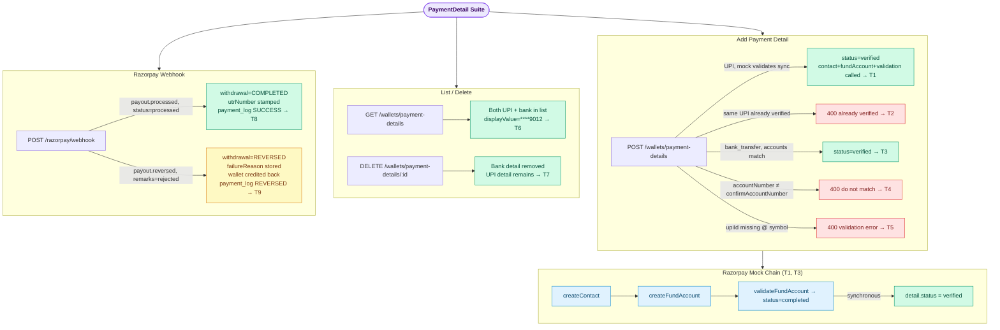

# PaymentDetail E2E Suite

## What this suite covers

End-to-end coverage of the payment detail and Razorpay webhook surface:

- Adding UPI and bank-transfer payment details (the full Razorpay contact → fund account → validation chain)
- Duplicate UPI guard (same verified UPI ID cannot be re-added)
- Validation errors: mismatched account numbers, invalid UPI format
- Listing payment details (shape, masked account number, status)
- Deleting a payment detail
- Razorpay webhook: `payout.processed` → marks withdrawal COMPLETED, writes payment log with UTR
- Razorpay webhook: `payout.reversed` → marks withdrawal REVERSED, credits balance back to wallet, writes payment log

## Intentionally out of scope

- `POST /wallets/payment-details/:id/auto-verify` — only active when `PINELABS_MOCK_VERIFICATION=true` (not set in test env)
- `fund_account.validation.completed` / `fund_account.validation.failed` webhooks — the synchronous mock path (`validateFundAccount` returns `status: 'completed'` immediately) already exercises the happy path; async webhook flows are unit-tested
- `payment.captured` / `payment.failed` webhooks (₹1 Razorpay Payment Link flow) — superseded by the fund account validation flow
- PineLabs webhook (`POST /api/webhooks/pinelabs`) — legacy; covered by unit tests

## Endpoints exercised

| Method | Path | Tests |
|---|---|---|
| POST | `/wallets/payment-details` | T1 (UPI), T2 (duplicate), T3 (bank), T4 (mismatched), T5 (invalid format) |
| GET | `/wallets/payment-details` | T6 |
| DELETE | `/wallets/payment-details/:id` | T7 |
| POST | `/razorpay/webhook` | T8 (`payout.processed`), T9 (`payout.reversed`) |

## Actors

| Mobile | Role | Token variable |
|---|---|---|
| 9000000001 | user (farmer) | `farmerToken` |

All other seeded users are present (via `seedTestUsers`) but not directly used in this suite.

## Seeded data (beforeAll)

| Item | How seeded | Purpose |
|---|---|---|
| 6 test users + wallets + admin config | `seedTestUsers()` | Base users; farmer wallet used for balance assertions |

Per-test helpers seed withdrawal requests for T8 and T9 inline via `seedProcessingWithdrawal()`.

## External services mocked

No real HTTP calls are made. `RazorpayPayoutService` is fully mocked in `app.helper.ts` and overridden in the NestJS testing module via `.overrideProvider(RazorpayPayoutService)`.

| Method mocked | Default return | What it enables |
|---|---|---|
| `createContact` | `{ contactId: 'ct_test_default', active: true }` | UPI and bank-transfer detail creation |
| `createFundAccount` | `{ fundAccountId: 'fa_test_default', contactId: 'ct_test_default', active: true }` | Fund account step |
| `validateFundAccount` | `{ validationId: 'val_default', fundAccountId: 'fa_test_default', status: 'completed', active: true }` | Synchronous validation → service immediately marks detail `verified` |
| `initiatePayout` | `{ payoutId: 'po_test_default', status: 'processing', utrNumber: null }` | Used by admin withdrawal processing (AdminOps suite); not called in this suite |

The Razorpay **webhook** controller (`RazorpayWebhookController`) is **not** mocked — it runs real business logic against the real test database. Tests post directly to `/razorpay/webhook` with hand-crafted payloads to simulate what Razorpay would send.

## Business logic exercised

- **Razorpay 3-step chain on addPaymentDetail:** `createContact` → `createFundAccount` → `validateFundAccount`. All three mock calls are verified in T1.
- **Synchronous verification:** `validateFundAccount` mock returns `status: 'completed'`, so the service bypasses the async webhook path and marks the detail `verified` immediately. This reflects the production VPA (UPI) case.
- **Duplicate guard:** `paymentDetailRepo.findOne({ userId, upiId, status: 'verified' })` fires before creating a new record (T2).
- **Account number confirmation:** service compares `accountNumber` and `confirmAccountNumber` before encrypting (T4).
- **Masked display value:** bank detail `displayValue` is `****<last4>` (T6).
- **Webhook: payout.processed:** `reference_id: 'wd_<withdrawalId>'` is parsed; withdrawal updated to `COMPLETED`, `utrNumber` and `processedAt` stamped, payment log created (T8).
- **Webhook: payout.reversed:** wallet balance is credited back via `WalletsService.creditReversedWithdrawal`; withdrawal updated to `REVERSED`; payment log status is `REVERSED` (T9).

## Flow diagram

> To preview locally: install "Markdown Preview Mermaid Support" in VS Code, then press Ctrl+Shift+V.



## Last run

| Date | Pass | Fail | Notes |
|---|---|---|---|
| 2026-07-14 | 9 | 0 | All green; no regressions in other suites |
| 2026-07-24 | 8 | 1 | T7 newly failing — see below. Not a regression in this suite's own logic; a real caching bug newly exposed by provisioning Redis for the test environment. |

**T7 — real product bug, not fixed (flagged for you to decide on):**

```
AssertionError: expected [ …(2) ] to not include '<bankDetailId>'
  at test/e2e/payment-detail/PaymentDetail.e2e.test.ts:193:21
```

`DELETE /wallets/payment-details/:id` is decorated `@CacheInvalidate('wallet:*')`
(`wallets.controller.ts`), but `GET /wallets/payment-details` is cached under the
`'payment_details'` key prefix (`@Cacheable('payment_details', 60)`), which
`CacheInterceptor.buildKey()` turns into `http:payment_details:u<userId>` — a key that does
**not** match the `wallet:*` SCAN pattern at all. So deleting a payment detail never
invalidates the list's cache; a prior `GET /wallets/payment-details` call in the same 60s
window keeps serving the stale (pre-delete) list. Same root cause and same discovery path as
the `WalletReward` T6/T7 finding: this test environment never had a real Redis instance until
2026-07-24 (see `docker-compose.test.yml`'s history), so `CacheInterceptor` always treated
every request as a MISS and this invalidation-pattern mismatch was invisible until Redis was
actually provisioned. Not test-related — the test's own assertion is correct.
