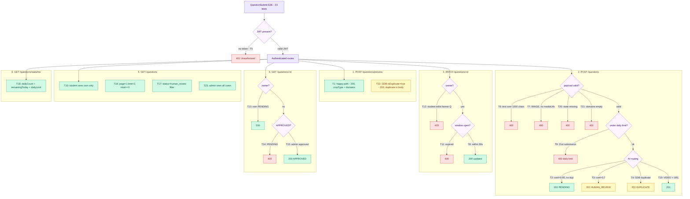

# Question Submit — E2E Test Documentation

**File:** `test/e2e/question-submit/QuestionSubmit.e2e.test.ts`

---

## What this covers

The full question lifecycle from a farmer's perspective: preview, submit, edit, read,
list, and daily-stats endpoints — exercised against the **real PostgreSQL DB** configured
in `.env` using the NestJS in-process harness.

| Method  | Endpoint                    | Purpose                                  |
|---------|-----------------------------|------------------------------------------|
| `POST`  | `/questions/preview`        | Enrich payload; check GDB before submit  |
| `POST`  | `/questions`                | Submit question; triggers AI pipeline    |
| `PATCH` | `/questions/:id`            | Edit question text within edit window    |
| `GET`   | `/questions/:id`            | Read a single question                   |
| `GET`   | `/questions`                | List questions (paginated, filterable)   |
| `GET`   | `/questions/stats/me`       | Daily submission count + remaining quota |
| `POST`  | `/questions/:id/approve`    | Admin approval (used to set up T15)      |

---

## Strategy

**In-process NestJS server** — `createTestApp()` boots the full production DI container
against the real DB. External AI services (`GemmaService`, `GdbService`) are replaced with
`vi.fn()` doubles so every test is deterministic regardless of the AI server's state.

Three test users are seeded via `seedTestUsers()` and authenticated at `beforeAll` time:

| Token         | Mobile       | Role    | Purpose                           |
|---------------|--------------|---------|-----------------------------------|
| `farmerToken` | `9000000001` | FARMER  | primary submitter                 |
| `studentToken`| `9000000002` | STUDENT | non-owner, second submitter       |
| `adminToken`  | `9000000005` | ADMIN   | approve questions, see all users  |

`seedQuestion()` bypasses the API to insert questions directly into the DB — used
wherever a test needs a pre-existing question in a specific state (expired edit window,
specific status, etc.) without consuming the daily quota.

---

## Auth strategy

`JwtAuthGuard` is applied globally in production. `createTestApp()` boots the real guard,
so every authenticated request must carry a valid JWT (`Authorization: Bearer <token>`).
`getAuthToken()` logs in via OTP and returns a real short-lived JWT. `vi.clearAllMocks()`
in `beforeEach` resets Gemma/GDB call counts without clearing their default mock
implementations.

---

## Flow diagram

> **To preview locally:** install the VS Code extension
> **"Markdown Preview Mermaid Support"** then press `Ctrl+Shift+V`.
> Diagrams also render natively on GitHub.

---

## Test cases (23 total)

### Preview (2 tests)

| #  | Test | Mock | Expected |
|----|------|------|----------|
| T1  | Preview — happy path | Gemma default | 200; `cropType` string, `domains` array |
| T22 | Preview — GDB duplicate flag reflected | GDB `isDuplicate=true`, score=0.97 | 200; `duplicate.isDuplicate=true`, `matchedQuestion` present |

### Submit — validation (4 tests)

| #  | Test | Expected |
|----|------|----------|
| T5  | Missing auth | 401 |
| T6  | `questionText` > 1000 chars | 400 |
| T7  | `mediaType=IMAGE`, `mediaUrls=[]` | 400 |
| T20 | Missing required field `state` | 400 |
| T21 | Empty `domains` array | 400 |

### Submit — AI routing (4 tests)

| #  | Test | Mock | Expected |
|----|------|------|----------|
| T2  | Happy path | Gemma confidence=0.95, GDB no dup | 201 · `PENDING` |
| T3  | Low confidence | Gemma confidence=0.7 | 201 · `HUMAN_REVIEW` |
| T4  | GDB duplicate detected | GDB `isDuplicate=true` | 201 · `DUPLICATE` |
| T19 | Valid video mediaType | studentToken, `mediaType=VIDEO` + URL | 201 |

### Submit — daily limit (1 test)

| #  | Test | Setup | Expected |
|----|------|-------|----------|
| T9  | Daily limit enforcement | Seed 19 questions → submit 20th (201) → submit 21st | 400 · message contains "daily limit" |

### Edit window (3 tests)

| #  | Test | Setup | Expected |
|----|------|-------|----------|
| T8  | Edit within 30 s | Submit via API, immediately PATCH | 200 |
| T11 | Edit after window closes | `seedQuestion` with `editWindowClosesAt` in the past | 400 |
| T12 | Non-owner edit | `seedQuestion` for farmer, PATCH with `studentToken` | 403 |

### Read single (3 tests)

| #  | Test | Setup | Expected |
|----|------|-------|----------|
| T13 | Owner reads own pending | `seedQuestion` for farmer | 200 · correct `id` + `questionText` |
| T14 | Non-owner reads non-approved | `seedQuestion` PENDING | 403 |
| T15 | Any user reads approved | `seedQuestion` → admin approves → student reads | 200 · `status=APPROVED` |

### List (4 tests)

| #  | Test | Expected |
|----|------|----------|
| T10 | Ownership isolation | `studentToken` list contains only student's own questions |
| T16 | Pagination | `?page=1&limit=2` → 2 items, `total≥3`, `pages≥2` |
| T17 | Status filter | `?status=human_review` → every item is `HUMAN_REVIEW` |
| T23 | Admin sees all | `adminToken` list contains farmer's seeded question |

### Stats (1 test)

| #  | Test | Expected |
|----|------|----------|
| T18 | Daily stats | `dailyCount`, `remainingToday`, `dailyLimit` present; `remainingToday = max(0, limit − count)` |

---

## Notable implementation details

- **`seedQuestion()`** inserts directly into the DB, bypassing the API daily-limit check.
  Used in T11, T12, T13, T14, T15, T16, T17, T23.
- **Daily limit test (T9)** wipes all of the farmer's questions first (`questionRepo.delete`)
  then seeds exactly 19, ensuring the 20th API call succeeds and the 21st hits 400 —
  regardless of how many submissions accumulated from previous runs.
- **Stats invariant (T18):** `dailyCount + remainingToday` can exceed `dailyLimit` when the
  same DB is used across multiple test runs on the same calendar day. The assertion uses
  `remainingToday === max(0, limit − count)` instead of the sum.
- **`vi.clearAllMocks()`** in `beforeEach` resets call counts but not `mockResolvedValue`
  implementations — the default Gemma/GDB stubs persist across tests; per-test overrides use
  `mockResolvedValueOnce`.

---

## Cleanup

`afterAll` calls `cleanTestData(dataSource)` which deletes all rows created by the test seed
users, then closes the NestJS application.

---

## Last run

**Date:** 2026-07-08 | **Result:** 23/23 passed | **Duration:** ~56 s

| #  | Test | Result |
|----|------|:------:|
| T1  | Preview — happy path | ✅ |
| T2  | Submit — happy path → PENDING | ✅ |
| T3  | Submit — low confidence → HUMAN_REVIEW | ✅ |
| T4  | Submit — GDB duplicate → DUPLICATE | ✅ |
| T5  | Submit — missing auth → 401 | ✅ |
| T6  | Submit — questionText > 1000 chars → 400 | ✅ |
| T7  | Submit — mediaType IMAGE no URLs → 400 | ✅ |
| T8  | Edit within 30 s → 200 | ✅ |
| T9  | Daily limit enforcement → 400 | ✅ |
| T10 | Get my questions — ownership isolation | ✅ |
| T11 | Edit after window closes → 400 | ✅ |
| T12 | Non-owner edit → 403 | ✅ |
| T13 | GET /:id — owner reads own pending → 200 | ✅ |
| T14 | GET /:id — non-owner reads non-approved → 403 | ✅ |
| T15 | GET /:id — approved visible to any user → 200 | ✅ |
| T16 | Pagination — correct page size and totals | ✅ |
| T17 | Status filter — only HUMAN_REVIEW returned | ✅ |
| T18 | GET /stats/me — daily count + remaining + limit | ✅ |
| T19 | Submit — video mediaType with URL → 201 | ✅ |
| T20 | Submit — missing state → 400 | ✅ |
| T21 | Submit — empty domains → 400 | ✅ |
| T22 | Preview — GDB duplicate flag reflected | ✅ |
| T23 | GET /questions — admin sees all users | ✅ |
