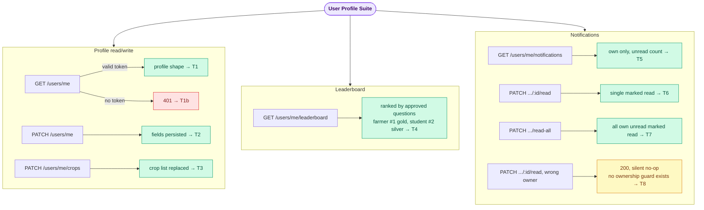

# User Profile E2E Suite

## What this suite covers

End-to-end coverage of `UserController` (`/users/me/*`) — a controller no other e2e suite
touches:

- `GET /users/me` profile shape, and the JWT guard on the controller
- `PATCH /users/me` field updates, persisted across requests
- `PATCH /users/me/crops` full crop-list replacement, persisted across requests
- `GET /users/me/leaderboard` ranking against real seeded questions/transactions (rank, medal,
  `totalEarned`, `totalQuestions`, `isCurrentUser`, `userRank`)
- `GET /users/me/notifications` pagination + unread count + data isolation between users
- `PATCH /users/me/notifications/:id/read` and `.../read-all`
- The notification "ownership guard" that turns out not to exist (see Business logic below)

## Intentionally out of scope

- Nothing deferred — this controller is pure DB CRUD behind the existing `JwtAuthGuard`, no
  external service in the path (per the test plan's Layer 8 entry).

## Endpoints exercised

| Method | Path | Tests |
|---|---|---|
| GET | `/users/me` | T1, T1b, T2 (verify), T3 (verify) |
| PATCH | `/users/me` | T2 |
| PATCH | `/users/me/crops` | T3 |
| GET | `/users/me/leaderboard` | T4 |
| GET | `/users/me/notifications` | T5 |
| PATCH | `/users/me/notifications/:id/read` | T6, T8 |
| PATCH | `/users/me/notifications/read-all` | T7 |

## Actors

| Mobile | Role | Used in |
|---|---|---|
| 9000000001 | user (farmer) | All tests — primary actor |
| 9000000002 | user (student) | T4 (leaderboard second entrant), T5/T7/T8 (isolation / non-owner) |

## Seeded data

| Item | How seeded | Purpose |
|---|---|---|
| 6 test users + wallets + admin config | `seedTestUsers()` (beforeAll) | Base users |
| 3 approved questions + reward transactions (₹1, ₹1, ₹5) for farmer; 1 approved question + ₹1 reward for student | Direct repo inserts in T4 | Leaderboard ranking data |
| Notifications for farmer (×2) and student (×1) | Direct repo inserts in T5 | Pagination + isolation |

No AI/payment mocks needed — this controller never calls an external service.

## Business logic exercised

- **Leaderboard only ranks `role: 'user'` accounts with ≥1 approved question** — curator, finance,
  admin, and super\_admin test users never appear regardless of activity
  (`user.service.ts`'s `getLeaderboard`, `WHERE u.role = 'user' AND totalQuestions > 0`). T4 seeds
  data for exactly the farmer and student accounts so it doesn't need to special-case this.
- **`totalEarned` sums only `CREDIT` + `REWARD` + `COMPLETED` transactions** — a withdrawal debit
  or a pending transaction would not double-count into the ranking; T4 seeds transactions with
  that literal type/source/status combination.
- **Notification "ownership guard" doesn't exist (T8).** `markAsRead(userId, notificationId)`
  scopes its `UPDATE` with `{ id, userId }` (`user.service.ts`). When the `userId` doesn't match
  the notification's actual owner, the `UPDATE` simply matches zero rows — there's no prior
  `findOne` + ownership check that would throw `NotFoundException`/`ForbiddenException`. The
  controller (`user.controller.ts`) doesn't inspect the affected-row count either — it
  unconditionally returns `{ success: true }`. Net effect: a non-owner's request to mark someone
  else's notification read returns **200**, not 403/404, and silently no-ops rather than mutating
  another user's data. Confirmed safe (no cross-user data corruption is possible), but the
  response code doesn't signal the no-op — noted here since the original test plan assumed a
  403/404 guard that isn't actually implemented.
- **`PATCH /users/me/crops` is a full replace, not a merge** — `updateCropDetails` sets
  `user.crops = dto.crops ?? []` outright (`user.service.ts`), matching the `UpdateCropDetailsDto`
  doc comment ("Replace the user's crop list. Thin wrapper around updateProfile.").

## Additional case beyond the original test plan

- **T1b — missing auth token → 401.** Not in the original Layer 8 table but added for parity with
  every other suite's guard-enforcement check (`QuestionSubmit` T5, `AdminOps` T2, etc.) — cheap
  to add given the controller-level `@UseGuards(JwtAuthGuard)`.

## Flow diagram

> To preview locally: install "Markdown Preview Mermaid Support" in VS Code, then press Ctrl+Shift+V.

## Last run

| Date | Pass | Fail | Notes |
|---|---|---|---|
| 2026-07-17 | 9 | 0 | All green, both standalone and as part of the full `vitest run` (103-test) suite. The same 3 pre-existing, unrelated failures (`WalletReward.e2e.test.ts` T8/T18, `AIPipeline.e2e.test.ts` "Admin config…") reproduce identically with this file included — confirmed not caused by this suite. |
| 2026-08-12 | 8 | 1 | `develop` migrated the backend from PostgreSQL/TypeORM to MongoDB/Mongoose (see `test_plan.md`'s 2026-08-12 section). Rewrote this suite's `DataSource` usage onto the repository abstraction. T4 (leaderboard) fails on two real bugs found while writing this pass — see below. |

**T4 — two real bugs, not fixed here:**

1. `question.schema.ts:91`'s Mongo text index (`QuestionSchema.index({ questionText: 'text' })`) has no `default_language: 'none'` override. MongoDB automatically treats any field literally named `language` on a document as a per-document text-search stemming directive, and only recognizes a fixed set of language names — not ISO codes like `'mr'`/`'hi'`/`'ta'`. Inserting a `Question` with `language: 'mr'` throws `MongoServerError: language override unsupported: mr` outright (reproduced directly). Currently masked in the real submit flow only because `QuestionService.submit()` never actually reads `dto.language` (grepped — zero references) — real submissions always fall through to the schema default (`'en'`) regardless of what's sent, which is itself a second, separate gap (a documented DTO field with no effect). This test's `seedApprovedQuestion()` now omits `language` to avoid tripping the crash.
2. `GET /users/me/leaderboard` always returns empty in Mongo mode: `UserService.getLeaderboard()` (`user.service.ts:117`) still builds the leaderboard entirely from hand-written raw PostgreSQL strings (`SELECT ... ::float ... JOIN ... GROUP BY`) passed as the "relation" argument into `this.userRepo.createQueryBuilder('u').leftJoin(sqlString, ...)`. `MongoQueryBuilder` has no SQL parser — it only recognizes a small set of structured TypeORM condition-string patterns — so this whole method never worked and effectively no-ops. The repository layer already has a real Mongo-native replacement sitting unused: `MongoUserRepository.getLeaderboard()` (an aggregation pipeline: `$match → $group → $sort`) is fully implemented but `UserService.getLeaderboard()` never calls it.
