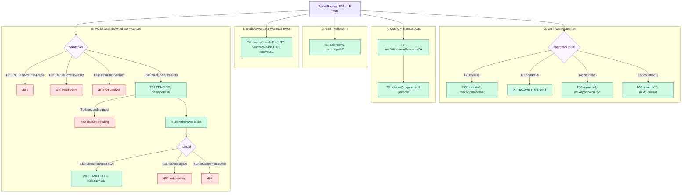

# Wallet & Reward — E2E Test Documentation

**File:** `test/e2e/wallet-reward/WalletReward.e2e.test.ts`

---

## What this covers

Wallet balance, reward tier calculation, reward crediting, withdrawal lifecycle
(create → list → cancel), and all rejection paths — exercised through the **real HTTP
layer** against the live PostgreSQL DB.

| Method   | Endpoint                          | Purpose                                   |
|----------|-----------------------------------|-------------------------------------------|
| `GET`    | `/wallets/me`                     | Balance + currency                        |
| `GET`    | `/wallets/me/tier`                | Reward tier for a given approvedCount     |
| `GET`    | `/wallets/me/config`              | minWithdrawalAmount from admin config     |
| `GET`    | `/wallets/me/transactions`        | Paginated transaction history             |
| `GET`    | `/wallets/me/withdrawals`         | Paginated withdrawal list                 |
| `POST`   | `/wallets/withdraw`               | Request withdrawal (requires verified PD) |
| `DELETE` | `/wallets/withdrawals/:id`        | Cancel a pending withdrawal               |

---

## Strategy

Same in-process NestJS harness as `QuestionSubmit`. No payment-provider mocks are needed:
`addPaymentDetail` (which calls Razorpay) is bypassed entirely by seeding `UserPaymentDetail`
rows directly into the DB. `creditReward` is called directly on the `WalletsService` instance
obtained from `app.get(WalletsService)` — this exercises the real transaction logic without
going through an HTTP route (there is no public `/credit-reward` endpoint).

| Token         | Mobile       | Role  | Purpose                                    |
|---------------|--------------|-------|--------------------------------------------|
| `farmerToken` | `9000000001` | USER  | primary wallet owner                       |
| `studentToken`| `9000000002` | USER  | non-owner used to test 404 isolation (T17) |

## Flow diagram

> **To preview locally:** open this file in VS Code and press `Ctrl+Shift+V` (or `Ctrl+K V`
> for side-by-side). Requires the **"Markdown Preview Mermaid Support"** extension
> (`bierner.markdown-mermaid`). Diagrams also render natively on GitHub.



---

**State flow for withdrawal tests:**

```
setWalletBalance(200) + seedVerifiedDetail()
        │
        ▼
   T10: withdraw 100  →  pendingWithdrawalId set, balance=100
        │
        ├─ T11: amount=10 (< ₹50 min)  → 400
        ├─ T12: amount=500 (> balance)  → 400
        ├─ T13: unverified detail       → 400
        ├─ T14: second request          → 400 (pending exists)
        ├─ T18: list withdrawals        → pendingWithdrawalId present
        │
        ▼
   T15: cancel pending  →  status=CANCELLED, balance=200
        │
        ├─ T16: cancel again            → 400 (not pending)
        └─ T17: student cancels         → 404
```

---

## Test cases (18 total)

### Balance (1 test)

| #  | Test | Expected |
|----|------|----------|
| T1 | GET /wallets/me — fresh wallet | 200 · `{ balance: 0, currency: 'INR' }` |

### Reward tiers (4 tests)

| #  | Test | Query | Expected |
|----|------|-------|----------|
| T2 | Tier 1 lower bound | `approvedCount=0`   | reward=1, maxApproved=26, nextTier≠null |
| T3 | Tier 1 upper bound | `approvedCount=25`  | reward=1 |
| T4 | Tier 2 entry       | `approvedCount=26`  | reward=5, maxApproved=251 |
| T5 | Tier 3 + no next   | `approvedCount=251` | reward=10, nextTier=null |

### Credit reward (2 tests)

| #  | Test | Call | Expected |
|----|------|------|----------|
| T6 | Tier 1 credit | `creditReward(approvedCount=1)`  | balance becomes ₹1 |
| T7 | Tier 2 credit | `creditReward(approvedCount=26)` | balance becomes ₹6 (1+5) |

### Wallet config (1 test)

| #  | Test | Expected |
|----|------|----------|
| T8 | GET /wallets/me/config | `minWithdrawalAmount=50` (from seeded admin config) |

### Transactions (1 test)

| #  | Test | Expected |
|----|------|----------|
| T9 | GET /wallets/me/transactions | `total≥2`; at least one entry with `type='credit'` |

### Withdraw (5 tests)

| #   | Test | Setup | Expected |
|-----|------|-------|----------|
| T10 | Happy path | balance=200, verified UPI detail | 201 · status=PENDING · balance=100 |
| T11 | Below minimum | amount=10, min=50 | 400 · "at least ₹50" |
| T12 | Exceeds balance | amount=500, balance=100 | 400 · "Insufficient" |
| T13 | Unverified detail | seeded `in_progress` detail | 400 · "not verified" |
| T14 | Duplicate pending | pending from T10 still active | 400 · "already pending" |

### Withdrawals list (1 test)

| #   | Test | Expected |
|-----|------|----------|
| T18 | GET /wallets/me/withdrawals | `total≥1`; T10's `pendingWithdrawalId` in `items[].id` |

### Cancel withdrawal (3 tests)

| #   | Test | Expected |
|-----|------|----------|
| T15 | Cancel PENDING | 200 · status=CANCELLED · balance restored to 200 |
| T16 | Cancel CANCELLED again | 400 · "Only a pending withdrawal can be cancelled" |
| T17 | Non-owner cancel (studentToken) | 404 |

---

## Notable implementation details

- **Reward tier boundary:** `getRewardAmount` uses `count < t.maxApproved`, so `approvedCount=25`
  stays in tier 1 (reward=₹1) and `approvedCount=26` enters tier 2 (reward=₹5). T3/T4 pin
  both sides.
- **Verified payment detail bypass:** `addPaymentDetail` calls Razorpay. Tests skip it by
  inserting `UserPaymentDetail` with `status='verified'` directly into the DB via
  `dataSource.getRepository(UserPaymentDetail)`.
- **creditReward isolation:** called directly on `WalletsService` (no public HTTP route).
  Uses a pessimistic write lock on the wallet row inside a transaction.
- **Cancel refund:** `cancelWithdrawal` atomically marks withdrawal CANCELLED, restores
  wallet balance, and marks the original debit transaction as REVERSED. T15 verifies all
  three effects via the balance GET.
- **Non-owner 404:** `cancelWithdrawal` returns `NotFoundException` (not 403) when
  `withdrawal.userId !== userId`, intentionally hiding the existence of other users'
  withdrawals. T17 confirms this.
- **Test ordering:** T10 → T14 → T18 → T15 → T16 → T17 is stateful by design.
  `pendingWithdrawalId` is captured from T10's response and reused across the sequence.

---

## Cleanup

`afterAll` calls `cleanTestData(dataSource)` (full `TRUNCATE … CASCADE`) then closes the app.

---

## Last run

**Date:** 2026-07-24 | **Result:** 16/18 passing. Root-caused after `develop` was merged into
this branch and the test environment was brought up to match (see below) — 2 real product
bugs remain, both left unfixed per team decision ("we are only testers").

**T8 — fixed, was a test-fixture bug, not a product bug.** Previously failed with
`expected '50' to be 50` (string vs number). Root cause: `test/e2e/helpers/seed.helper.ts`
seeded `admin_config` rows with string values (`min_withdrawal_amount: '50'`), but every real
write path (`AdminService.DEFAULT_CONFIG`, `CreateConfigDto`/`UpdateConfigDto` via
`@Type(() => Number)`) always produces real numbers — the seed helper was the only place a
string ever entered this column. Fixed by seeding numbers instead of strings; no source change
needed.

**T18 — still fails, real product bug, not fixed (flagged for you to decide on):**

```
QueryFailedError: column wr.rejectionreason does not exist
  at WalletsService.getWithdrawals (src/wallets/wallets.service.ts:203)
```

`getWithdrawals()`'s query builder selects `'wr.rejectionReason'`, but `WithdrawalRequest` only
has `failureReason` — confirmed via git history (`git log -S"wr.rejectionReason"`) that a
commit once renamed `failureReason` → `rejectionReason` "for clarity", but the entity was later
reverted back to `failureReason` without this one query-builder call site being updated. So
`GET /wallets/me/withdrawals` 500s unconditionally, for every caller, always. Not test-related.

**T6, T7 — still fail, real product bug newly discovered while root-causing this batch, not
fixed (flagged for you to decide on):**

```
AssertionError: expected +0 to be 1  // T6, after creditReward(approvedCount=1)
AssertionError: expected +0 to be 6  // T7, after creditReward(approvedCount=26)
```

`GET /wallets/me` is `@Cacheable('wallet', 60)` in `wallets.controller.ts`. Reward crediting
(`WalletsService.creditReward`, called internally from `AdminService.reviewQuestion` when a
question is approved — a completely different controller) never runs through any endpoint
decorated with `@CacheInvalidate('wallet:*')`. Only 4 endpoints in `wallets.controller.ts`
invalidate that pattern (`withdraw`, `cancelWithdrawal`, `addPaymentDetail`,
`deletePaymentDetail`) — approving a question isn't one of them. **This bug was completely
invisible until now**: this test environment's `docker-compose.test.yml` never provisioned a
real Redis instance (confirmed via its own git history — it never has), so every
`RedisService.get()`/`.set()` call silently failed and the `CacheInterceptor` always treated
every request as a cache MISS, masking any invalidation gap. Provisioning Redis for the test
environment (`redis-test` service added 2026-07-24) is what exposed this — the caching logic
is now genuinely exercised for the first time. In real usage, a farmer who checks their wallet
balance and then has a question approved within the next 60 seconds would see a stale
(pre-reward) balance. T6/T7 themselves call `creditReward()` directly on the service (bypassing
HTTP entirely, as documented above) purely to avoid a Razorpay dependency — but the same gap
would reproduce through the real HTTP admin-approval endpoint too, since that endpoint has the
same missing invalidation.

**Date:** 2026-08-12 | **Result:** 6/18 passing. `develop` migrated the backend from
PostgreSQL/TypeORM to MongoDB/Mongoose (see `test_plan.md`'s 2026-08-12 section). Rewrote this
suite's `DataSource` usage onto the new repository abstraction. The old T18/T6/T7 findings
above are Postgres-era and their current status under Mongo is **unverified** — the queries
they targeted are now unreachable, blocked upstream by two much bigger, newly-confirmed bugs
that between them account for all 12 of this run's failures:

1. **`WalletsService.creditReward()`/`.withdraw()`/`.cancelWithdrawal()` all throw
   unconditionally** (`wallets.service.ts:102, 287, 363`): each calls
   `this.ds.createQueryRunner()` for its balance-update transaction, but `this.ds` is an
   `@Optional()` TypeORM `DataSource` that `AppModule` never provides in Mongo mode (no
   `TypeOrmModule.forRoot()` anywhere) — `Error: DataSource is not available when DB=mongo`,
   every time, in any environment, not just tests. **Reward crediting and withdrawal
   create/cancel are completely non-functional right now.** Blocks T6, T7, T9 (depends on
   T6/T7), T10, T15, T16, T17, T18 (all depend on T10 succeeding).

2. **`WithdrawDto.paymentDetailId` is validated with `@IsUUID('4', ...)`**
   (`wallets/dto/index.ts:16`), but every id in Mongo mode is a 24-char ObjectId hex string,
   never a UUID — `POST /wallets/withdraw` always 400s with `"Invalid payment detail ID"`
   before it can even reach bug (1) above. Blocks T11–T14, which now hit this validation error
   instead of their originally-intended code paths (amount-below-minimum, insufficient
   balance, unverified detail, duplicate-pending — none of that logic is ever reached).

Both are real, confirmed (not guessed — traced via server-side stack traces), not fixed here.
Two smaller, separately-confirmed real bugs surfaced and were worked around at the test-seed
level only (not fixed, and not the cause of any remaining failure): `UserPaymentDetail
.verificationOrderId` is `unique: true, default: null` with no `sparse` flag, so a second
seeded detail with an explicit null collides — worked around by giving each seeded detail a
unique placeholder value.
